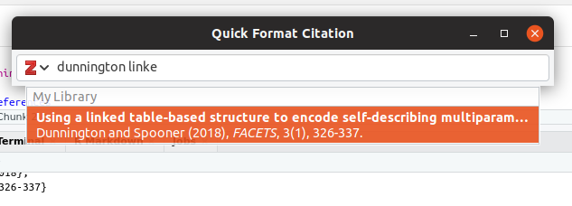

<!-- README.md is generated from README.Rmd. Please edit that file -->

```{r setup, include = FALSE}
knitr::opts_chunk$set(
  collapse = TRUE,
  comment = "#>",
  fig.path = "man/figures/README-",
  out.width = "100%"
)
```

# rbbt

The goal of **rbbt** is to connect R to the [Better Bibtex for Zotero connector](https://retorque.re/zotero-better-bibtex/cayw/). This allows the insertion of in-text citations (pandoc or LaTex style) and BibLaTex bibliography items directly into the RStudio editor using the RStudio addin, or to the console otherwise.

## Installation

You can install rbbt from GitHub with:

``` r
devtools::install_github("paleolimbot/rbbt")
```

You will also need [Zotero](https://www.zotero.org/) installed and running, and the [Better BibTeX for Zotero](https://retorque.re/zotero-better-bibtex/installation/) add-on installed.

## Example

Insert in-text citations using the RStudio addin (from the Addins menu), or from the console. Make sure Zotero is running when you do this!

```{r, eval=FALSE, comment=""}
# opens a window for citation selection
bbt_cite()
```



```
@dunnington.spooner18
```

Insert bibliography text from selected items in Zotero using the RStudio Addin, or print to the console using `bbt_bib_zotero()`:

```{r, eval=FALSE, comment=""}
# uses whatever is currently selected in the zotero window
bbt_bib_zotero()
```

```
@article{dunnington.spooner18,
  title = {Using a Linked Table-Based Structure to Encode Self-Describing Multiparameter Spatiotemporal Data},
  volume = {3},
  doi = {10.1139/facets-2017-0026},
  number = {1},
  journaltitle = {FACETS},
  date = {2018},
  pages = {326-337},
  author = {Dunnington, Dewey W. and Spooner, Ian S.}
}
```

## References
